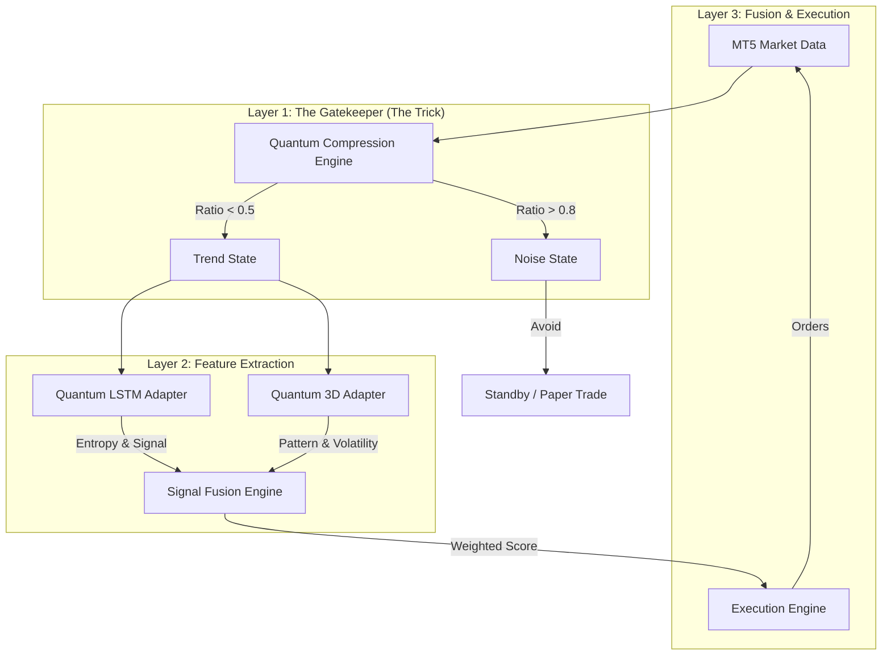

# ETARE Quantum Fusion: System Architecture

**Version:** 2.0 (Rebuild)
**Date:** January 23, 2026
**Core Philosophy:** "The Trick" — Using Quantum Information Theory to predict *predictability* itself.

---

## 1. High-Level Architecture

The system is a **Hybrid Quantum-Classical Execution Engine**. It does not try to predict price directly; it predicts the *state of the market* (Trend vs. Noise) using quantum compression, then uses specialized adapters to extract profit.

---

## 2. Component Technical Breakdown

### Layer 1: Quantum Compression Engine (The Core)
**File:** `modules/compression_layer.py`
*   **Input:** 256 bars of Close prices (Time-series data).
*   **Mechanism:** Recursive Quantum Autoencoder (6-layer Ansatz, RY/CNOT gates).
*   **The "Trick":** It attempts to compress the 256 data points into fewer qubits.
    *   **Logic:** If the data *can* be compressed (Ratio < 0.6), it contains **Information** (Patterns/Trend).
    *   **Logic:** If the data *cannot* be compressed (Ratio ~1.0), it is **Entropy** (Random Noise).
*   **Output:** `Regime` (High/Low Compressibility) + `Clean State` (Denoised Quantum State).

### Layer 2: Quantum Adapters (The Specialists)
These modules only activate when Layer 1 confirms a "Tradeable" state.

**A. Quantum LSTM Adapter**
*   **File:** `modules/quantum_lstm_adapter.py`
*   **Input:** Price Data + Quantum Features (7 metrics).
*   **Mechanism:** Bidirectional LSTM (Long Short-Term Memory) neural network.
*   **Role:** Times the entry based on momentum and quantum entropy.
*   **Status:** Active.

**B. Quantum 3D Adapter**
*   **File:** `modules/quantum_3d_adapter.py`
*   **Input:** 4D Market Data (Price, Time, Volume, Volatility).
*   **Mechanism:** CatBoost Classifier + 8-Qubit Quantum Encoder.
*   **Role:** Detects structural market anomalies (e.g., "Yellow Clusters" indicating reversals).
*   **Status:** Active.

### Layer 3: Signal Fusion & Execution
*   **Config:** `config/fusion_weights.json`
*   **Mechanism:** A weighted voting system.
    *   Compression Ratio: 25% weight.
    *   LSTM Signal: 20% weight.
    *   3D Pattern: 15% weight.
*   **Execution:** Connects to MT5 via standard IPC bridge. Uses `Magic Number 73049`.

---

## 3. Data Flow & Latency

1.  **Tick:** MT5 receives a tick.
2.  **Buffer:** Python accumulates 256 M5 bars (approx. 21 hours of data).
3.  **Compress (Layer 1):** ~150ms processing time.
    *   *Decision Point:* If Noise -> STOP.
4.  **Extract (Layer 2):** ~50ms parallel processing.
5.  **Fuse & Fire (Layer 3):** <10ms.
6.  **Total Latency:** ~210ms (Acceptable for M5 timeframe).

---

## 4. Hardware Requirements

*   **GPU:** AMD Radeon RX 6800 (Used for LSTM inference & Quantum Simulation via ROCm/OpenCL).
*   **CPU:** Handles the MT5 IPC bridge and lighter logic.
*   **Storage:** Minimal IO; mostly in-memory processing.

---

## 5. "The Trick" Explained

Traditional bots fail because they trade **Noise** as if it were **Trend**. They use moving averages on random walks.

**ETARE Quantum Fusion** asks a different question first:
> *"Is this data mathematically random?"*

If the Compression Engine says **YES (Ratio > 0.8)**, the system **does not trade**, no matter what the RSI or MACD says. It waits. This prevents the "drawdown due to chop" that kills most systems.

---

**System Status:**
*   Layer 1 (Compression) is built and validated.
*   Layer 2 (Adapters) are built.
*   Layer 3 (Fusion) is the next build step.
